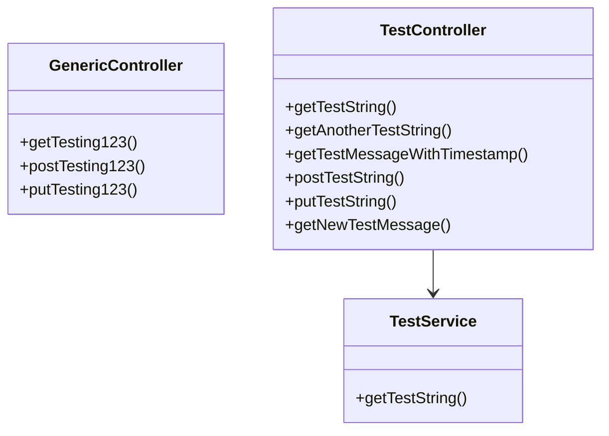

# AI Test API Diagram

This documentation uses Mermaid diagrams for visualizing the API structure. Update this diagram whenever endpoints are added or changed.

```mermaid
classDiagram
    class GenericController {
        +getTesting123()
        +postTesting123()
        +putTesting123()
    }
    class TestController {
        +getTestString()
        +getAnotherTestString()
        +getTestMessageWithTimestamp()
        +postTestString()
        +putTestString()
        +getNewTestMessage()
    }
    class TestService {
        +getTestString()
    }
    TestController --> TestService
```
